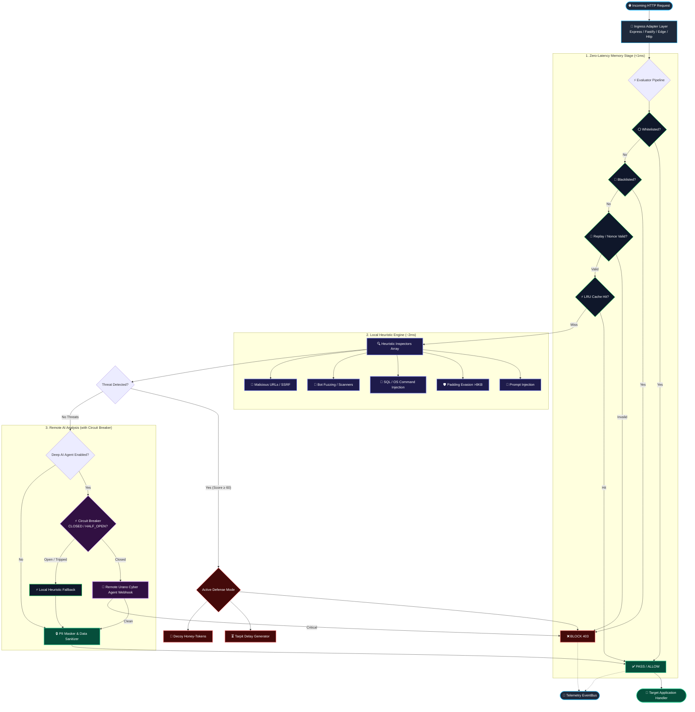
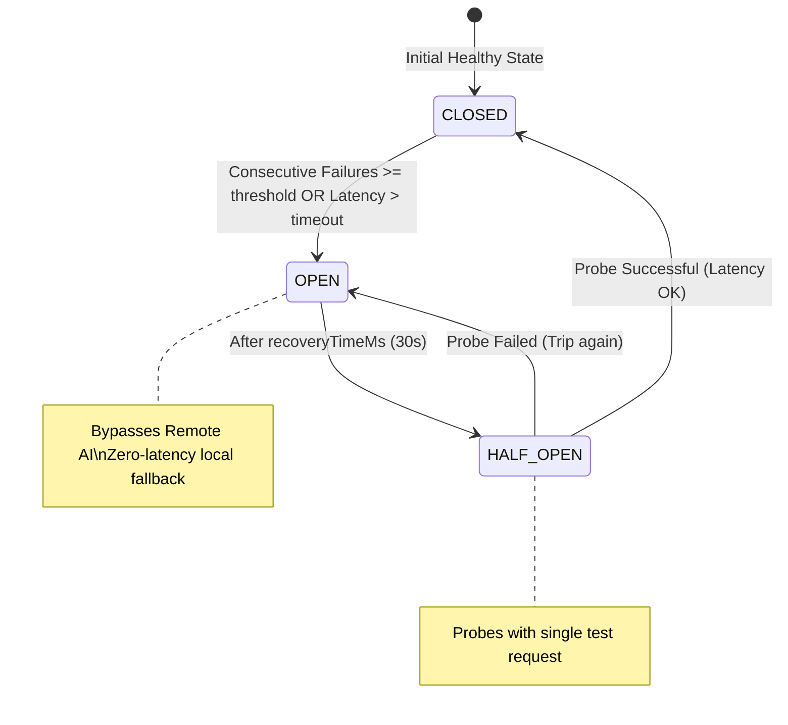
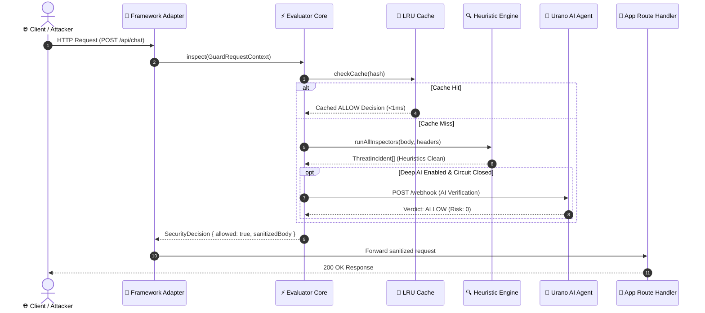

# 🏛️ Architecture & Developer Blueprint — `@uranotools/urano-guard`

> This document provides a comprehensive technical breakdown of **Urano Guard's** internal architecture, lifecycle pipeline, design principles, extension points, and development roadmap.

---

## 📐 High-Level Architectural Pipeline

Urano Guard operates as a **low-latency security perimeter and AI Web Application Firewall (WAF)** that intercepts requests before reaching application logic or intelligent agent runtimes.



---

## ⚡ Tri-State Circuit Breaker State Machine

When communicating with upstream AI evaluators, the Circuit Breaker guarantees zero service degradation via auto-recovery state transitions:



---

## 🔄 End-to-End Request Sequence



---

## ⚡ The 5 Golden Rules of Urano Guard Performance

When contributing code or writing new inspectors, you must adhere to these five architectural constraints:

1. **Zero Heavy External Dependencies:** The core SDK must remain ultra-lightweight. No heavy machine-learning packages or native C++ addons in the runtime hot-path.
2. **Sub-Millisecond Heuristic Budget (<2ms):** All local regular expressions and inspectors must execute in $\le 2\text{ms}$. Regular expressions must be audited against Catastrophic Backtracking (ReDoS).
3. **Fail-Open by Design:** If a remote AI evaluation agent fails, times out, or becomes unresponsive, the `CircuitBreaker` trips to `OPEN` and the system defaults to local heuristics without interrupting legitimate traffic.
4. **Bounded Memory Usage:** All caches (Decision LRU, Nonce Store, Fingerprint Table) use strict maximum entry limits and automated sweep/eviction routines to prevent memory leaks in long-running Node.js processes.
5. **Deterministic Immutability:** Context objects (`GuardRequestContext`) are normalized once at ingress; payload transformations (like PII masking) only produce sanitized copies without mutating raw request headers.

---

## 🧩 Extension Points for Contributors

Urano Guard is designed with strict inversion of control. Contributors can extend the SDK in 4 key areas:

### 1. Adding a New Threat Inspector (`src/inspectors/`)

```ts
import { InspectorBase, GuardRequestContext, ThreatIncident } from '@uranotools/urano-guard';

export class GraphQLAbuseInspector extends InspectorBase {
    readonly name = 'GraphQLAbuseInspector';
    readonly enabled: boolean;

    constructor(enabled = true) {
        super();
        this.enabled = enabled;
    }

    inspect(context: GuardRequestContext): ThreatIncident | null {
        if (!this.enabled) return null;

        const bodyStr = typeof context.body === 'string' ? context.body : JSON.stringify(context.body || '');
        
        if (bodyStr.includes('__schema') || bodyStr.includes('__type')) {
            return {
                id: `thr_gql_${Date.now()}`,
                category: 'CUSTOM',
                severity: 'MEDIUM',
                riskScore: 65,
                summary: 'GraphQL introspection probe detected.',
                detectedAt: new Date().toISOString(),
                sender: context.senderId || context.ip
            };
        }

        return null;
    }
}
```

---

### 2. Adding a Framework Adapter (`src/adapters/`)

```ts
import { AdapterBase, GuardRequestContext } from '@uranotools/urano-guard';

export class HonoAdapter extends AdapterBase {
    middleware() {
        return async (c: any, next: () => Promise<void>) => {
            const ctx: GuardRequestContext = {
                ip: c.req.header('x-forwarded-for') || '127.0.0.1',
                method: c.req.method,
                path: c.req.path,
                headers: c.req.header(),
                body: await c.req.json().catch(() => ({})),
                timestamp: new Date().toISOString()
            };

            const decision = await this.guard.inspect(ctx);
            if (!decision.allowed) {
                return c.json({ error: 'Blocked by Urano Guard', reason: decision.reason }, 403);
            }

            await next();
        };
    }
}
```

---

### 3. Subscribing to Security Telemetry (`src/core/EventBus.ts`)

```ts
const guard = createUranoGuard({ ... });

guard.eventBus.on('threatDetected', ({ threat, req }) => {
    datadog.increment('waf.threat_detected', 1, [`category:${threat.category}`]);
});

guard.eventBus.on('honeyTokenAccessed', ({ token, req }) => {
    slack.sendAlert(`🚨 ATTACKER TRAPPED: Attacker returned with Honey-Token ${token} from IP ${req.ip}`);
});
```

---

## 🗺️ Architectural Roadmap

| Component | Status | Priority | Target Release |
|---|:---:|:---:|:---:|
| **Tri-State Circuit Breaker & Fail-Open** | ✅ Complete | High | v1.0.0 |
| **Deep Padding Evasion Inspector (>8KB)** | ✅ Complete | High | v1.0.0 |
| **Anti-Replay Nonce + Timestamp Guard** | ✅ Complete | High | v1.0.0 |
| **Semantic Campaign Rate Limiter** | ✅ Complete | High | v1.0.0 |
| **Behavioral Request Fingerprinter** | ✅ Complete | High | v1.0.0 |
| **Decoy Honeypot & Tarpit Engine** | ✅ Complete | High | v1.0.0 |
| **GraphQL Introspection & Depth Inspector** | ✅ Complete | Medium | v1.0.0 |
| **JWT Tampering & Algorithm Confusion Inspector** | ✅ Complete | High | v1.0.0 |
| **Hono Adapter** | ✅ Complete | Medium | v1.0.0 |
| **Configurable BYO Remote Agent** | ✅ Complete | High | v1.0.0 |
| **OpenTelemetry / Prometheus Metrics Exporter** | 🚧 Interface + EventBus counters | High | v1.2.0 |
| **Elysia.js Adapter** | 🚧 Planned | Medium | v1.1.0 |
| **WebAssembly (WASM) Custom Rules Engine** | 💡 Proposed | Low | v2.0.0 |
