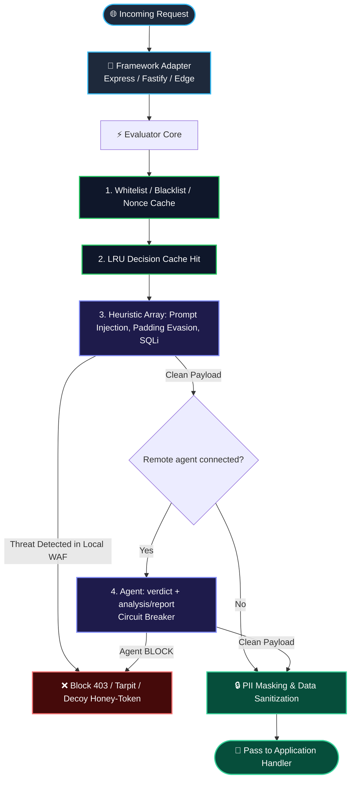

# 🛡️ Urano Guard (`@uranotools/urano-guard`)

[](https://www.npmjs.com/package/@uranotools/urano-guard)
[](https://www.npmjs.com/package/@uranotools/urano-guard)
[](LICENSE)
[](https://www.typescriptlang.org/)
[](https://nodejs.org/)
[](https://github.com/uranotools/urano-guard/actions)
[](CONTRIBUTING.md)
[](SECURITY.md)

> **Local-first WAF** that **integrates an agent into your structure**. Inspectors run in-process. The agent is a service you own (or Urano’s, if you point the URL there) — Guard only calls it.

The WAF stays on the request path. The **agent** is the plus: analysis, reports, NEED + declared skills. This package is not the agent and does not host models. See [CUSTOM_AGENT.md](CUSTOM_AGENT.md).

### What's new in 1.2.1

**Async SharedStore** (`setNX`, `sadd` / `smembers`, `decr`, `cas`) plus **`RedisSharedStore`**. Shared circuit, atomic replay, `await guard.ready()`. **`createHttpAuditSink`**, **`failClosed`**, Prometheus. Agent responses may include **`analysis` / `report`** (`decision.agentAnalysis` / `agentReport`). Cluster notes: [ENTERPRISE.md](ENTERPRISE.md). Agent: [CUSTOM_AGENT.md](CUSTOM_AGENT.md). Full notes: [CHANGELOG.md](CHANGELOG.md).

### What’s new in 1.1

BYO remote agent, text normalization + evasion corpus, split SQLi/CMD/XSS, JWT/GraphQL inspectors, Hono, route policies, and safer defaults (`trustProxy` off, 403 without score leak). Local chat + agent demo: [examples/README.md](examples/README.md).

---

## 💡 How It Works (At a Glance)

* 🟢 **Local WAF first**: Heuristics run in-process. No cloud account and no agent required to start.
* 🧠 **Connectable agent (the parallel plus)**: Point `remoteAgent.url` at any HTTPS endpoint you operate — laptop, VPC, another region, an LLM, or a SOC service. The agent returns a verdict and may attach **analysis** and a **report**. Guard forwards those on `SecurityDecision`; it does not write the report itself.
* ⚡ **Cheap path stays local**: Obvious SQLi, jailbreaks, and padding evasions die on regex before you spend tokens on the agent (`invokeWhen: 'local_clean'`).
* 🛡️ **Fail-open by default**: If the agent times out or returns bad JSON, the circuit breaker falls back to local inspectors. Use `failClosed` when a missed remote verdict must block.

---

## ⚡ Key Capabilities

* 🧠 **LLM & Prompt Injection Defense**: Real-time detection of system prompt overrides, jailbreaks, roleplay subversions, and instruction leakage.
* 🛡️ **Padding Evasion Detection**: Deep payload analysis (tail & middle sampling) to defeat attackers hiding exploits at the end of large requests (>8KB).
* ⚡ **Low-latency local path**: In-memory LRU cache and a zero-dependency regex engine handle obvious probes locally. This is not a claim that most real attacks are caught before the agent.
* 🛑 **Tri-State Circuit Breaker**: Auto-recovering breaker (`CLOSED` ➔ `OPEN` ➔ `HALF_OPEN`) with **Fail-Open** guarantee so your production traffic is never disrupted.
* 🔁 **Anti-Replay Attack Protection**: Cryptographic nonce cache and timestamp validation windows to prevent request replay exploits.
* 📊 **Semantic Rate Limiting**: Intent-based rate limiting to block distributed reconnaissance campaigns targeting identical endpoints across multiple rotating IPs.
* 🕵️ **Behavioral Fingerprinting**: Identifies repeated attackers across proxy/Tor networks regardless of IP rotation.
* 🍯 **Active Defense (Honeypot & Tarpit)**: Slows down automated scrapers with configurable tarpit delays and generates traceable honey-tokens for SOC telemetry.
* 🔒 **PII Masker & Sanitizer**: Masks Luhn-valid credit cards, emails, E.164 phones, and common API key prefixes (`sk-`, `ghp_`, `AKIA`, `xoxb-`, …) on allowed requests.
* 🔌 **Framework adapters**: Express, Fastify, Hono, Edge (Cloudflare / Vercel), and native Node.js HTTP.

---

## 📦 Installation

```bash
# pnpm
pnpm add @uranotools/urano-guard

# npm
npm install @uranotools/urano-guard

# yarn
yarn add @uranotools/urano-guard

# bun
bun add @uranotools/urano-guard
```

---

## 🧠 Security agent (optional, recommended plus)

The WAF is the in-process perimeter. **Integrate an agent into your structure:** Guard POSTs out; the agent never opens a port on your app. You (or Urano, if `AGENT_URL` is Urano infra) run that process, the model, and the reports. Guard only enforces the contract: declared fields, declared skills, one follow-up, API key / HMAC.

Same schema on localhost, a VPC, or Urano. Small first hop; `NEED` + declared skills; optional `maxFollowUps`, store-backed `memory`, and `investigateAsync` so a long report does not stall the request. `response.include` gates `analysis` / `report`.

```ts
const guard = createUranoGuard({
    remoteAgent: {
        url: process.env.AGENT_URL, // any HTTPS URL you control
        invokeWhen: 'local_clean',
        auth: { type: 'bearer', token: process.env.AGENT_TOKEN },
        payload: {
            include: ['method', 'path', 'body', 'localThreats'],
            extra: { app: 'checkout' }
        }
    }
});

const decision = await guard.inspect(ctx);
if (decision.agentReport) {
    await tickets.create(decision.agentReport);
}
```

Contract, privacy notes, report shape, and a sample server: **[CUSTOM_AGENT.md](CUSTOM_AGENT.md)**.

---

## 🚀 Quickstart

### 1. Express.js Integration (100% Local / Zero Setup)

```ts
import express from 'express';
import { createUranoGuard } from '@uranotools/urano-guard';

const app = express();
app.use(express.json());

// Initialize Guard (Works locally without external dependencies)
const guard = createUranoGuard({
    securityMode: 'block_threats',
    inspectors: {
        promptInjection: true,
        paddingEvasion: true,
        sqlAndCommands: true,
        piiDataMasking: true
    }
});

// Protect all incoming routes
app.use(guard.express());

app.post('/api/chat', (req, res) => {
    // req.body is automatically sanitized (PII masked, threats blocked)
    res.json({ message: 'Request processed securely' });
});

app.listen(3000, () => console.log('Protected server running on port 3000'));
```

---

### 2. Fastify Integration

```ts
import Fastify from 'fastify';
import { createUranoGuard } from '@uranotools/urano-guard';

const fastify = Fastify();
const guard = createUranoGuard({ securityMode: 'block_threats' });

fastify.addHook('preHandler', guard.fastify());

fastify.post('/v1/webhook', async (req, reply) => {
    return { status: 'ok' };
});

fastify.listen({ port: 3000 });
```

---

### 3. Edge / Cloudflare Workers Integration

```ts
import { createUranoGuard } from '@uranotools/urano-guard';

const guard = createUranoGuard({ securityMode: 'strict_zero_trust' });

export default {
    async fetch(request: Request): Promise<Response> {
        const decision = await guard.edge()(request);
        
        if (!decision.allowed) {
            return new Response(JSON.stringify({ error: 'Blocked by Urano Guard', reason: decision.reason }), {
                status: 403,
                headers: { 'Content-Type': 'application/json' }
            });
        }

        return fetch(request);
    }
};
```

---

## 📐 Architecture Pipeline



---

## ❓ Frequently Asked Questions (FAQ)

<details>
<summary><b>1. Do I need an external AI server or Urano account to use Urano Guard?</b></summary>
<br/>
<b>No.</b> The local WAF runs on its own. The remote <b>agent</b> is the optional (and recommended) plus: connect it when you want a model, a SOC service, or generated reports. There is no Urano Cloud account requirement.
</details>

<details>
<summary><b>2. Is the remote webhook called for every single request?</b></summary>
<br/>
<b>Not by default.</b> Requests flow through an ascending-cost pipeline:
<ol>
  <li>Cache or whitelist → allow without inspectors or agent.</li>
  <li>Obvious local hits (jailbreak / SQLi / …) → block without calling the agent when <code>invokeWhen</code> is <code>local_clean</code> (default). That saves tokens.</li>
  <li>The agent runs when it is configured, the circuit is closed, and <code>invokeWhen</code> says so (<code>local_clean</code> / <code>local_suspicious</code> / <code>always</code>).</li>
</ol>
</details>

<details>
<summary><b>3. What happens if my remote AI webhook goes down or times out?</b></summary>
<br/>
By default Urano Guard is <b>fail-open</b>: if the remote endpoint fails or exceeds <code>timeoutMs</code> (default: 1500ms), the breaker trips to <code>OPEN</code> and local heuristics decide. Set <code>failClosed: true</code> when a missed remote verdict must block (see <a href="ENTERPRISE.md">ENTERPRISE.md</a>).
</details>

<details>
<summary><b>4. What is the performance overhead on my API?</b></summary>
<br/>
Cache hits are memory lookups. Cold heuristic evaluations are typically a few milliseconds depending on payload size. The core SDK has zero runtime dependencies (no bundled models).
</details>

---

## ⚙️ Configuration Reference

```ts
import { UranoGuardConfig, createPrometheusMetrics } from '@uranotools/urano-guard';

const config: UranoGuardConfig = {
    securityMode: 'block_threats', // start with 'monitor_only' in production to measure false positives
    trustProxy: false,
    exposeDecisionDetails: false,
    failOpen: true,          // default. Use failClosed: true to block on remote/adapter errors
    // failClosed: false,
    maxBodyBytes: 256 * 1024,

    auditLogger: 'json',     // or createHttpAuditSink({ url }) — never includes body/cookies/Authorization
    metrics: createPrometheusMetrics(),
    // store: new RedisSharedStore({ client }),
    // crowdsec: { url: process.env.CROWDSEC_LAPI, apiKey: process.env.CROWDSEC_KEY }, // optional IP reputation
    // await guard.ready();

    remoteAgent: {
        url: process.env.AGENT_URL, // omit for 100% local
        timeoutMs: 1500,
        invokeWhen: 'local_clean',
        auth: { type: 'bearer', token: process.env.AGENT_TOKEN }
    },

    circuitBreaker: {
        enabled: true,
        latencyThresholdMs: 800,
        failureThreshold: 5,
        recoveryTimeMs: 30_000
    },

    replayGuard: {
        enabled: false,
        timestampWindowMs: 300_000,
        strict: false
    },

    semanticRateLimit: {
        enabled: false,
        windowMs: 60_000,
        maxRequestsPerWindow: 60,
        campaignIpThreshold: 20
    },

    honeypot: {
        tarpitEnabled: false,
        tarpitDelayMs: 4_000,
        honeyTokensEnabled: false
    },

    routePolicies: [
        { path: '/health', method: 'GET', skip: true }
    ],

    inspectors: {
        promptInjection: true,
        maliciousUrls: true,
        sqlAndCommands: true,
        sqlInjection: true,
        commandInjection: true,
        xss: true,
        botFuzzing: true,
        piiDataMasking: true,
        paddingEvasion: true,
        jwtTampering: true,
        graphqlAbuse: true,
        maliciousUrlsAllowHosts: ['api.internal.example']
    }
};
```

---

## 🛠️ Advanced Extensibility & Architecture Blueprint

Production rollout, store / Redis, fail-closed, audit: [**ENTERPRISE.md**](ENTERPRISE.md). Agent contract (analysis + reports): [**CUSTOM_AGENT.md**](CUSTOM_AGENT.md). Internals: [**ARCHITECTURE.md**](ARCHITECTURE.md), [**DEV_README.md**](DEV_README.md), [**AGENTS.md**](AGENTS.md).

---

## 🤝 Contributing

We welcome contributions from the cybersecurity and AI safety community!
Please read [AGENTS.md](AGENTS.md) (for AI IDEs and new contributors), the [Contributing Guide](CONTRIBUTING.md), and the [Code of Conduct](CODE_OF_CONDUCT.md) before submitting Pull Requests.

---

## 🔒 Security Vulnerabilities

If you discover a potential security vulnerability or bypass technique, please refer to our [Security Policy](SECURITY.md).

---

## 📄 License

This project is licensed under the **MIT License** — see the [LICENSE](LICENSE) file for details.
